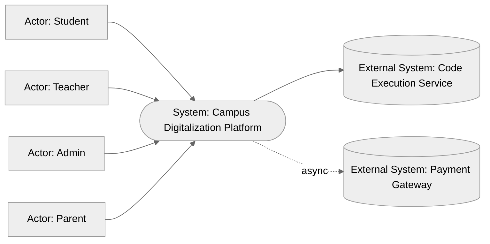
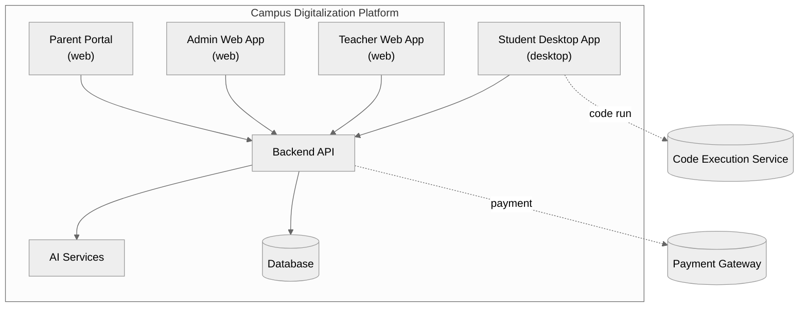
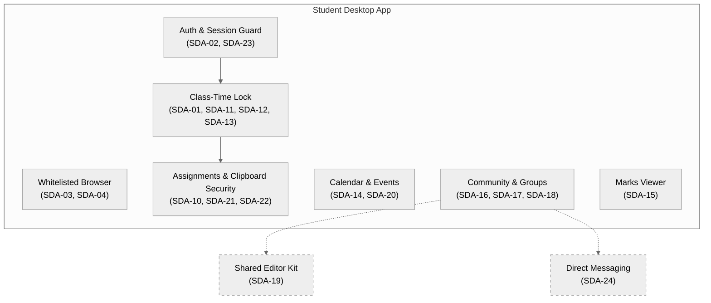
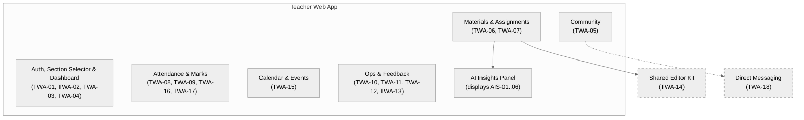
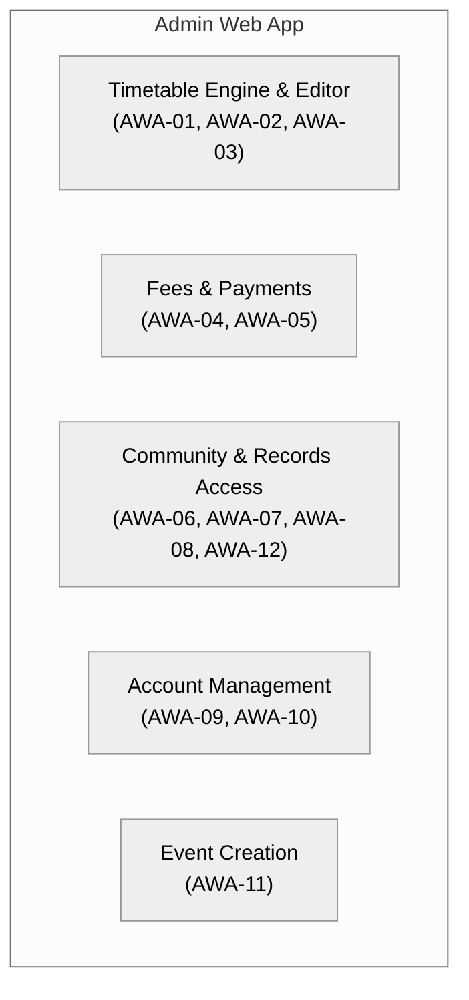
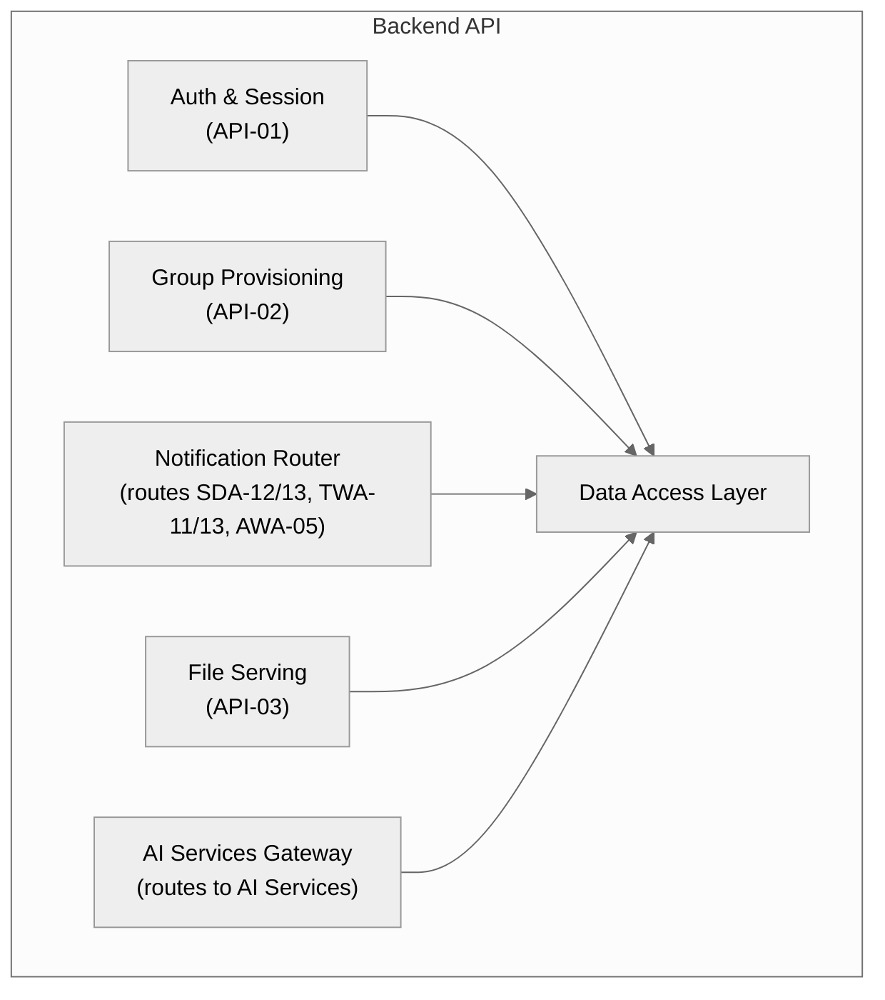

# Campus Digitalization Platform — Architecture

## 0. Naming & Notation Registry [Core]

| Element | Canonical Name | Code | Type |
|---|---|---|---|
| Student | Student | — | Actor |
| Teacher | Teacher | — | Actor |
| Admin | Admin | — | Actor |
| Parent | Parent | — | Actor |
| Student desktop application | Student Desktop App | SDA | Container |
| Teacher web application | Teacher Web App | TWA | Container |
| Admin web application | Admin Web App | AWA | Container |
| Shared backend | Backend API | API | Container |
| Primary data store | Database | DB | Container |
| AI-driven subsystem (plagiarism, autograding, browsing summary) | AI Services | AIS | Container |
| Third-party code runner | Code Execution Service | CEX | External System |
| Third-party payments | Payment Gateway | PAY | External System |
| Shared code/document/notes editor, used by both SDA and TWA | Shared Editor Kit | SEK | Component (shared, cross-container) |
| Shared 1:1 messaging, used by both SDA and TWA | Direct Messaging | DMS | Component (shared, cross-container) |
| Parent-facing web application | Parent Portal | PRT | Container |

**Diagram legend** (reused on every diagram in this document):

| Symbol / Style | Meaning |
|---|---|
| Solid box | Container (independently deployable) |
| Dashed box | Component (internal to a container, or shared across containers) |
| Solid arrow → | Synchronous call / dependency |
| Dashed arrow ⇢ | Async / event / message |
| Cylinder | Data store |

---
## 1. Overview & Objectives [Core]

**One-paragraph summary:** A single platform unifying three role-specific applications — a locked-down Student desktop app, a Teacher web app, and an Admin web app — on one shared backend and data model, replacing the separate LMS + ERP + proctoring-tool stack most colleges run today.

**Problem statement:** Campus tools (LMS, attendance, timetable, fees, community/groups) are normally separate systems that don't share data. This platform puts student, teacher, and admin workflows on one backend so a single action (e.g. a teacher marking attendance, or a student submitting an assignment) is immediately visible to every role that needs it.

**Objectives:**
1. Every student/teacher/admin workflow listed in Section 3 is reachable from its role's app without a separate tool.
2. Class-time engagement is enforced (full-screen + exit notification) only during scheduled class or assignment windows — never as a standing background restriction.
3. Assignment plagiarism/copy-checking and grading run automatically and land in front of the teacher for review, not for blind auto-posting.
4. Timetable generation is automatic by default but always manually overridable by Admin.

**Non-goals / Out of scope:**
- Exam-lockdown hardening (VM detection, screen-recording detection, webcam-based AI proctoring). This is daily-use software, not an exam-proctoring tool — confirmed explicitly.
- Voice-recognition attendance, Google Calendar sync, WhatsApp/auto-call fee reminders — named by the person as future-phase, not this round.
- Admissions/enrollment intake, mobile apps, hostel/transport/library modules — not mentioned in the request; not included here.
- **Role/permission model (RBAC) is deliberately not finalized in this revision** — the person is replacing the flat Teacher/Admin distinction with a Google-IAM-style role+permission system but asked to be presented options first (see Section 16). Section 3 features reference permissions generically (e.g. "a role holding the `view_browsing_history` permission") until that's decided; a dedicated Data Model section will follow once it is.

---

## 3. Features [Core]

### Features — `Student Desktop App` (`SDA`)

| ID | Feature | Description | Priority | Requirement (EARS) | Acceptance Criteria |
|---|---|---|---|---|---|
| SDA-01 | Class-time full-screen lock | App goes full-screen and blocks switching away during a scheduled class session | Must | While a scheduled class session is active, the Student Desktop App shall enforce full-screen mode and block switching to other applications. | Outside class hours, no restriction applies; during class hours, Alt-Tab/window-switch is blocked. |
| SDA-02 | Login (Roll No + Password + TOTP) | Three-factor login | Must | When a student submits roll number, password, and a TOTP code, the Student Desktop App shall authenticate against the Backend API and grant access only if all three are valid. | Wrong password, wrong TOTP, or unknown roll number each reject login with a distinct message. |
| SDA-03 | Whitelisted built-in browser | Navigation restricted to an approved site list | Must | While browsing inside the Student Desktop App, the system shall restrict navigation to sites on the class's approved whitelist. | Navigating to a non-whitelisted URL is blocked with an explanatory message. |
| SDA-04 | Whitelist addition request | Student can ask teacher to add a site | Should | When a student requests a new site be added to the whitelist, the Student Desktop App shall forward the request to the Teacher Web App for approval. | Teacher sees a pending-request queue; approval makes the site browsable without a student-side restart. |
| SDA-08 | Browser clipper into notes | Clip content from the built-in browser straight into a note | Should | When a student clips content from the built-in browser, the Student Desktop App shall save it as a new note or append it to an existing one. | Clipped content retains source URL as a reference. |
| SDA-10 | Assignment submission | Upload assignment files with a timestamp; format depends on the assignment's type | Must | When a student submits an assignment, the Student Desktop App shall accept the format matching the assignment's type (code, quiz answers, essay text, or file upload), upload it to the Backend API, and record a submission timestamp. | Submission after the deadline is flagged as late, not silently accepted as on-time; a quiz-type assignment cannot be submitted as a file upload. |
| SDA-11 | Auto-submit on exit during assignment window | Losing focus/exiting mid-assignment force-submits current state | Must | If a student exits or loses focus of the Student Desktop App during an active assignment window, then the system shall auto-submit the current state of the assignment. | Teacher's view marks the submission as auto-submitted, distinct from a manual submit. |
| SDA-12 | Exit notification during class | Leaving the app during class pings the teacher | Must | If a student exits the Student Desktop App during a scheduled class session, then the Backend API shall notify the assigned teacher in real time. | Teacher receives the notification within a few seconds of the exit event. |
| SDA-13 | No-login-while-marked-present alert | Marked present but never logged in pings the teacher | Should | If a student is marked present for a session but has not logged into the Student Desktop App within the session's grace period, then the Backend API shall notify the assigned teacher. | Notification fires once per session, not repeatedly. *(Grace-period length is an open question — see Section 16.)* |
| SDA-14 | Calendar | College-wide events, registered events, to-dos, custom events in one view | Must | The Student Desktop App shall display college-wide events, events the student is registered for, personal to-dos, and custom events in a single calendar. | All four event types are visually distinguishable in the same view. |
| SDA-15 | Marks viewing | View published marks per subject/assignment | Must | The Student Desktop App shall display a student's marks as published by teachers, per subject and assignment. | Unpublished marks are not visible to the student. |
| SDA-16 | Community groups | View/post in class, subject-section, and club groups; shared materials surface in Materials | Must | The Student Desktop App shall let a student view and post in groups they belong to, and shall surface any material shared in a group inside that group's Materials section. | A file posted in a group appears in Materials without a separate upload step. |
| SDA-17 | Teacher feedback | Submit feedback about a teacher/course | Should | The Student Desktop App shall let a student submit feedback about a teacher or course. | Feedback is attributable to the course/teacher it was submitted against. |
| SDA-18 | Course & teacher info | View course and teacher info per enrolled subject | Should | The Student Desktop App shall display course information and the assigned teacher's information for each enrolled subject. | Every enrolled subject has a non-empty course-info and teacher-info entry. |
| SDA-19 | Shared Editor Kit integration | Student Desktop App embeds the Shared Editor Kit (SEK-01..05) for code, document, and notes editing rather than implementing its own | Must | The Student Desktop App shall embed the Shared Editor Kit for all code editing, document viewing/annotation, and note-taking. | No editor/annotation/notes logic is implemented directly inside the Student Desktop App outside of SEK. |
| SDA-20 | Event registration screen | Students browse and register for college events from a dedicated screen | Must | When a student opens the events screen, the Student Desktop App shall list available college events and let the student register for any that are open. | A registered event appears in the student's Calendar (SDA-14) automatically. |
| SDA-21 | Isolated in-app clipboard | The app uses its own custom clipboard; the OS-level clipboard does not work inside it | Must | While the Student Desktop App is running, the system shall route all copy/cut/paste actions through an isolated in-app clipboard, not the OS clipboard. | Content copied inside the app cannot be pasted into an external application, and vice versa. |
| SDA-22 | Copy/cut/paste block during open assignment | While an assignment is open for editing, all clipboard actions are disabled | Must | While an assignment is open for editing, the Student Desktop App shall block copy, cut, and paste actions entirely, including within the isolated in-app clipboard. | Attempting copy/cut/paste while an assignment is open has no effect and shows a blocked-action message. |
| SDA-23 | Self-service password change with MFA | Student can change their own password but must pass an MFA/TOTP challenge first | Must | When a student requests a password change, the Student Desktop App shall require a successful TOTP challenge before applying the new password. | Password change is rejected if the TOTP challenge fails or is skipped. |
| SDA-24 | Direct Messaging integration | Student side of the shared Direct Messaging component (DMS-01) | Should | The Student Desktop App shall embed the Direct Messaging component for composing and reading messages to/from teachers. | No separate messaging logic exists inside the Student Desktop App outside of DMS. |
| SDA-25 | Usage telemetry for suspicious-behaviour detection | Client-side signal reporting, scoped to class/assignment windows only | Must | While a class session or assignment window is active (SDA-01, SDA-11, SDA-12, SDA-13), the Student Desktop App shall report usage-pattern telemetry to the AI Services container via the Backend API. | No telemetry is collected or sent outside a class session or assignment window. |
### Features — `Teacher Web App` (`TWA`)

| ID | Feature | Description | Priority | Requirement (EARS) | Acceptance Criteria |
|---|---|---|---|---|---|
| TWA-01 | Auto section selection | Timetable-driven default section on login | Must | When a teacher logs in, the Teacher Web App shall pre-select the section they are currently scheduled to teach, based on the timetable. | Correct section is pre-selected without manual search, for any time the teacher logs in during a scheduled period. |
| TWA-02 | Manual section switch | Change active section anytime | Must | The Teacher Web App shall let a teacher switch to any of their assigned sections at any time. | Switching sections updates the dashboard, attendance, and materials view to the new section immediately. |
| TWA-03 | Login (username + password + TOTP) | Same auth scheme as Student | Must | When a teacher submits username, password, and a TOTP code, the Teacher Web App shall authenticate via the Backend API. | Same rejection behavior as SDA-02. |
| TWA-04 | Class performance dashboard | Dashboard for the active section | Must | The Teacher Web App shall display a performance dashboard for the teacher's currently selected section. | Dashboard reflects marks/attendance data no older than the last sync. |
| TWA-05 | Community access & group creation | View all groups; create new groups, including club and teacher-only groups (class groups excluded — auto-created) | Must | The Teacher Web App shall let any teacher view community groups and create new groups — including groups visible only to other teachers — other than the auto-provisioned class group. | Every teacher account, regardless of role, can create at least one group; a teacher-only group is not visible to any student. |
| TWA-06 | Material upload | Upload to material section and/or post into a group | Must | When a teacher uploads material, the Teacher Web App shall attach it to the material section, a selected group, or both. | Material posted to a group also appears in that group's Materials section (mirrors SDA-16). |
| TWA-07 | Multi-type assignment creation | Create assignments with due date + submission window; type is code, quiz, essay, or file upload | Must | When a teacher creates an assignment, the Teacher Web App shall let them choose its type — code, quiz, essay, or file upload — set a due date and submission window, and configure type-specific settings. | An assignment with no due date cannot be published; each type stores only the settings relevant to it (e.g. quiz question bank, code starter files). |
| TWA-08 | Attendance marking | Mark attendance per session for the active section | Must | The Teacher Web App shall let a teacher mark attendance per session for the currently selected section. | Every enrolled student has an attendance status after marking is completed. |
| TWA-09 | Attendance alerts | Alert on low attendance | Should | If a student's attendance falls below the configured threshold, then the Backend API shall alert the teacher. | Alert references the specific student and current attendance percentage. *(Threshold value is an open question.)* |
| TWA-10 | Own timetable view | View the logged-in teacher's own timetable | Must | The Teacher Web App shall display the logged-in teacher's own timetable. | Timetable reflects the latest Admin-approved version. |
| TWA-11 | Section/student reporting to Admin | Submit a report that routes to Admin | Must | When a teacher submits a report on a section or student, the Backend API shall route it to Admin. | Admin's inbox shows the report with teacher, section/student, and timestamp. |
| TWA-12 | Section feedback | Teacher rates a section they've taught | Should | The Teacher Web App shall prompt a teacher to submit feedback about a section they have taught. | Feedback is stored against the section and feeds AWA-02. |
| TWA-13 | Timetable modification request | Request a timetable change from Admin | Should | When a teacher requests a timetable change, the Backend API shall route the request to Admin for approval. | Request shows as pending until Admin approves/rejects it. |
| TWA-14 | Shared Editor Kit integration | Teacher Web App embeds the Shared Editor Kit (SEK-01..05) instead of implementing its own editor/annotator/notes | Must | The Teacher Web App shall embed the Shared Editor Kit for all code editing, document viewing/annotation, and note-taking. | No editor/annotation/notes logic is implemented directly inside the Teacher Web App outside of SEK. |
| TWA-15 | Event creation | Teachers can create college/section events | Must | When a teacher creates an event, the Teacher Web App shall publish it so eligible students can register (SDA-20). | Created event appears in the events screen for every student eligible to register. |
| TWA-16 | Publish internal marks | Numeric internal marks entry and publishing, per subject/assignment | Must | When a teacher publishes internal marks for a subject or assignment, the Teacher Web App shall make them visible to enrolled students (SDA-15). | Marks are invisible to students until explicitly published. |
| TWA-17 | Publish external marks (time-limited permission) | Grade-based (not numeric) external marks entry, restricted to holders of an active `add_external_marks` permission grant | Must | Where a teacher holds an active, non-expired `add_external_marks` permission grant (Section 9), the Teacher Web App shall let them publish grade-based external marks for a subject; once the grant's expiry passes, the option shall no longer be available. | The entry option disappears automatically at the grant's expiry, without requiring manual revocation. |
| TWA-18 | Direct Messaging integration | Teacher side of the shared Direct Messaging component (DMS-01) | Should | The Teacher Web App shall embed the Direct Messaging component for an inbox of student messages. | No separate messaging logic exists inside the Teacher Web App outside of DMS. |
| TWA-19 | Timetable creation access (permission-gated) | A teacher holding the create_timetable permission gets the same timetable engine as AWA-01/02/03 | Should | Where a teacher holds the create_timetable permission, the Teacher Web App shall surface the same Timetable Engine & Editor described in AWA-01/AWA-02/AWA-03. | The timetable produced is the same object Admin sees and edits — not a separate copy. |
### Features — `Admin Web App` (`AWA`)

| ID | Feature | Description | Priority | Requirement (EARS) | Acceptance Criteria |
|---|---|---|---|---|---|
| AWA-01 | Automatic timetable generation | Generate a timetable from constraints + feedback; triggerable by anyone holding `create_timetable` | Must | When a user holding the `create_timetable` permission triggers timetable generation, the Backend API shall compute a timetable using section/teacher/subject constraints, applying each teacher's feedback-based exclusions (AWA-02). | Generated timetable contains no assignment that violates a stated exclusion, regardless of whether Admin or a permitted Lecturer (TWA-19) triggered it. |
| AWA-02 | Feedback-based teacher exclusion | Unsatisfied-teacher-to-section exclusion rule | Must | If a teacher has submitted negative feedback about a section (TWA-12), then the automatic timetable generator shall not assign that teacher to that section. | Re-running generation after new negative feedback removes that pairing from the next output. |
| AWA-03 | Manual/custom timetable editing | Full manual override of any generated timetable | Must | The Admin Web App shall let Admin manually create or edit any part of a generated timetable. | Manual edits persist through the next automatic-generation run unless Admin explicitly regenerates. |
| AWA-04 | Fee payment link | Generate a payable link for parents | Must | The Admin Web App shall generate a fee payment link that parents can use to pay fees via the Payment Gateway. | Link is valid for exactly the fee amount/period it was generated for. |
| AWA-05 | Parent payment reminder | Notify parents as due date approaches | Should | When a fee due date approaches, the Backend API shall notify the parent to pay. | Reminder fires at a configurable number of days before the due date. |
| AWA-06 | Full community access | View all groups institution-wide | Must | The Admin Web App shall let Admin view all community groups across the institution. | No group is excluded from Admin's view regardless of who created it. |
| AWA-07 | Student record access | View student info, teacher remarks, software reports | Must | The Admin Web App shall let Admin view any student's information, teacher-submitted remarks, and system-generated reports. | Record includes remarks and reports even if the submitting teacher is no longer active. |
| AWA-08 | Performance visibility | View any student's academic performance | Must | The Admin Web App shall let Admin view any student's academic performance. | Data matches what the student sees in SDA-15, not a separate copy. |
| AWA-09 | Account creation | Create student/teacher accounts | Must | The Admin Web App shall let Admin create new student or teacher accounts. | New account can log in immediately with the credentials Admin set. |
| AWA-10 | Password reset | Reset a user's password | Must | When Admin resets a user's password, the Backend API shall invalidate the old password and start a reset flow. | Old password stops working the moment the reset is confirmed. |
| AWA-11 | Event creation | Admin can create institution-wide events | Must | When Admin creates an event, the Admin Web App shall publish it so eligible students can register (SDA-20). | Created event appears in the events screen for every student eligible to register, same as TWA-15. |
| AWA-12 | Group creation | Admin can create community groups directly, in addition to viewing all existing groups (AWA-06) | Should | The Admin Web App shall let Admin create a new community group. | Group created by Admin is indistinguishable in structure from one created by a teacher (TWA-05). |
| AWA-13 | Manage roles & permissions | Assign role bindings, and grant/revoke individual permission overrides (with optional expiry) per user | Must | When Admin assigns a role or a permission override to a user, the Backend API shall update that user's effective permissions immediately, honoring any expiry set on the override. | A revoked or expired override stops applying without requiring the user to log out and back in. |
| AWA-14 | Manage departments | Create departments and assign a HoD to each | Should | The Admin Web App shall let Admin create a department and assign a HoD-role binding scoped to it. | A department has at most one active HoD binding at a time. |
### Features — `Backend API` (`API`)

| ID | Feature | Description | Priority | Requirement (EARS) | Acceptance Criteria |
|---|---|---|---|---|---|
| API-01 | Single active session enforcement | No parallel logins for one student/teacher account | Must | If a login is attempted for an account with an already-active session, then the Backend API shall reject the new session or terminate the existing one. | Two simultaneous sessions for the same account never coexist. *(Which behavior — reject vs. terminate — is an open question.)* |
| API-02 | Class group auto-provisioning | One class group created per class, every semester | Must | When a new semester starts, the Backend API shall automatically create one class group per class and enroll its students. | Every class has exactly one auto-created group at semester start, with no manual step required. |
| API-03 | Material download | Serve material files for download, not just inline viewing, to any app that can already view them | Must | When a user with view access to a material requests download, the Backend API shall serve the original file. | Downloaded file is byte-identical to what was uploaded, regardless of which app (Student, Teacher, Admin) requested it. |
### Features — `AI Services` (`AIS`)

| ID | Feature | Description | Priority | Requirement (EARS) | Acceptance Criteria |
|---|---|---|---|---|---|
| AIS-01 | Browsing history summary | Stored on the student's profile; visible only to roles holding the browsing-history permission | Could | The AI Services container shall generate a natural-language summary of a student's in-app browsing history and store it on the student's profile, visible only to a role holding the `view_browsing_history` permission. | A role without that permission cannot see the summary anywhere, including in the student's own profile view. |
| AIS-02 | Internet plagiarism check | Teacher-only. Check submissions against internet sources | Must | When an assignment is submitted, the AI Services container shall check it against internet sources and report a similarity score, surfaced only in the Teacher Web App. | Every submission has a similarity score before the teacher grades it; score is not shown to the submitting student. |
| AIS-03 | Cross-class copy-check | Teacher-only. Compare submissions against each other | Should | When assignments are submitted for a class, the AI Services container shall compare submissions against each other and flag pairs above a similarity threshold, surfaced only in the Teacher Web App. | Flagged pairs are visible to the teacher with matching sections highlighted; students are not notified of flags. *(Threshold value is an open question.)* |
| AIS-04 | Autograding | Teacher-only. Suggest a grade for teacher review | Should | When an assignment is submitted, the AI Services container shall generate a suggested grade, surfaced only in the Teacher Web App for review before publishing. | Suggested grade is never auto-published without teacher confirmation, and is never shown to the student as-is. |
| AIS-05 | AI-generated content detection | Detect likelihood a submission was AI-generated, distinct from internet plagiarism (AIS-02) | Must | When an assignment is submitted, the AI Services container shall estimate the likelihood it was AI-generated and report it to the teacher, surfaced only in the Teacher Web App. | Every text-based submission has an AI-likelihood score before the teacher grades it; score is not shown to the submitting student. |
| AIS-06 | Automatic course extraction from syllabus PDF (future) | Extract course information automatically from an uploaded syllabus PDF | Won't | Where a syllabus PDF is uploaded, the AI Services container shall extract course information for use in the Course & Teacher Info view (SDA-18). | Extracted fields are shown to Admin/Teacher for confirmation before being published as course info — never auto-published unreviewed. |
| AIS-07 | Suspicious behaviour & automation detection | Usage-pattern anomaly detection, scoped to class sessions and assignment windows only | Must | While a class session or assignment window is active, the AI Services container shall analyze usage-pattern telemetry (SDA-25) for suspicious behaviour or automation and flag anomalies, surfaced only in the Teacher Web App. | No analysis runs outside a class session or assignment window; flagged anomalies are never shown to the student. |

---
### Features — `Shared Editor Kit` (`SEK`)

| ID | Feature | Description | Priority (MoSCoW) | Requirement (EARS) | Acceptance Criteria |
|---|---|---|---|---|---|
| SEK-01 | Code editor | VS Code-style editor running code via the Code Execution Service (moved from SDA-05/TWA integration) | Must | When a user runs code in the editor, the Shared Editor Kit shall send it to the Code Execution Service and display the returned output or error. | Output/error appears in the editor pane; unsupported language shows a clear error, not a silent failure. |
| SEK-02 | Document viewer & annotator | View and annotate PDF, PPTX, DOCX with highlight, text box, ink, and basic OCR (moved from SDA-06) | Must | The Shared Editor Kit shall let a user view PDF, PPTX, and DOCX files and annotate PDFs with highlights, text boxes, ink, and basic OCR. | Highlight/text-box/ink annotations persist on reopening the same PDF. |
| SEK-03 | Markdown notes | Create/edit/delete linked Markdown notes, Obsidian-style (moved from SDA-07) | Must | The Shared Editor Kit shall let a user create, edit, and delete Markdown notes, including linking between notes. | Deleting a note removes it; links to it resolve to a not-found state, not a crash. |
| SEK-04 | Built-in image search | Image search is built directly into the notes editor, not a separate module (corrects earlier SDA-09 framing) | Could | Where in-app image search is available, the notes editor component of the Shared Editor Kit shall let a user search the web and insert images directly into a note. | Inserted image is embedded in the note, not just linked; no separate 'image search' screen exists outside the notes editor. |
| SEK-05 | Inking with basic block diagrams (future) | Extend ink annotation with Paint-style basic shapes/block-diagram drawing | Won't | Where diagram-ink mode is enabled, the Shared Editor Kit shall let a user draw basic shapes (rectangles, arrows, lines) as part of ink annotation. | Shapes snap to a light grid; diagram-mode strokes are stored as vector shapes, not raster ink, so they can be resized later. |

### Features — `Direct Messaging` (`DMS`)

| ID | Feature | Description | Priority (MoSCoW) | Requirement (EARS) | Acceptance Criteria |
|---|---|---|---|---|---|
| DMS-01 | Student-to-teacher direct messaging | One-to-one message thread between a student and a teacher | Should | When a student or teacher sends a direct message, the Direct Messaging component shall deliver it to the other party's inbox in their respective app. | Each thread is scoped to exactly one student-teacher pair. |

### Features — `Parent Portal` (`PRT`)

| ID | Feature | Description | Priority (MoSCoW) | Requirement (EARS) | Acceptance Criteria |
|---|---|---|---|---|---|
| PRT-01 | Parent login | Simple login for a parent to access their ward's data | Must | When a parent submits their credentials, the Parent Portal shall authenticate via the Backend API and grant access only to their own ward's data. | A parent can never see another student's data, even by guessing an ID. |
| PRT-02 | View ward attendance & marks | Read-only view of the ward's attendance and published marks | Must | The Parent Portal shall display the ward's attendance record and published marks (internal and external). | Unpublished marks are not visible, matching SDA-15's publish rule. |
| PRT-03 | Fee payment | Parent pays fees directly from the portal via the Payment Gateway | Must | When a parent initiates payment, the Parent Portal shall route it to the Payment Gateway and reflect the updated fee status once confirmed. | Fee status updates within the portal without requiring the parent to check a separate confirmation email. |

---

## 5. Constraints [Extended]

| Constraint | Type | Impact |
|---|---|---|
| No artificial per-user storage quota | Technical | Each user's document/notes/materials storage is bounded only by the shared GCS bucket's total capacity, not an individually enforced cap — simplifies storage logic but means one heavy user can affect what's left for others until the bucket itself is expanded. |

---

## 6. System Context (C4 Level 1) [Core]

Students, teachers, and admins interact through their own app; parents interact through a dedicated Parent Portal (Section 7) for viewing their ward's data and paying fees. The system calls out to the Code Execution Service synchronously (student is waiting for output) and to the Payment Gateway asynchronously (payment confirmation arrives via callback).

---

## 7. Container View (C4 Level 2) [Core]

| Container | Responsibility | Tech Stack |
|---|---|---|
| Student Desktop App | Full-screen class lock, whitelisted browser, assignments, calendar, events, marks, community, embeds Shared Editor Kit and Direct Messaging | TBD |
| Teacher Web App | Timetable-aware dashboard, attendance, materials, assignment creation, marks, events, feedback, community, embeds Shared Editor Kit and Direct Messaging | TBD |
| Admin Web App | Timetable generation/editing, fee links, event creation, group creation, account management, institution-wide visibility | TBD |
| Parent Portal | Read-only ward attendance/marks, fee payment | TBD |
| Backend API | Auth/session, data model, notification routing, group provisioning, material download | TBD |
| Database | System of record for accounts, groups, assignments, marks, attendance, timetable, roles/permissions | TBD |
| AI Services | Plagiarism/copy-check, AI-content detection, autograding, browsing-history summary, future syllabus extraction | TBD |

*(Tech stack column intentionally left TBD — not specified in the request; filling it in would be inventing scope.)*

---

## 8. Component View (C4 Level 3) [Extended]

Broken out per container so work can be divided along these boundaries — see the companion work-division document. `Shared Editor Kit` and `Direct Messaging` are cross-container components, not internal to any one app — drawn with a **dashed border** per the legend, connected by dashed (dependency) arrows, to keep them visually distinct from a container's own internal modules.

### 8a. Student Desktop App

### 8b. Teacher Web App

Split into two clusters below rather than one 12+ node diagram — day-to-day teaching tools vs. operations/AI-facing tools.

`AI Insights Panel` is display-only — it renders results computed by the `AI Services` container (Section 7); it runs no AI logic itself. This is where the permission-gated visibility rule for AIS-01 and the teacher-only rule for AIS-02/03/04/05 are enforced in the UI layer.

### 8c. Admin Web App

### 8d. Backend API

`Notification Router` is the single place that owns every ping/alert/routing requirement scattered across Section 3 (exit-ping, absence-ping, report routing, timetable-change routing, fee reminders) — consolidating them here avoids four different modules each reinventing delivery logic.

---

## 16. Open Questions [Core]

| Question | Owner | Status |
|---|---|---|
| Single-session policy: reject the new login, or silently kick the old session? (API-01) | Ruthvik | Open |
| Grace period length before an absence ping fires? (SDA-13) | Ruthvik | Open |
| Whitelist approval scope: does an approved site apply to the requesting student only, or the whole class? (SDA-04) | Ruthvik | Open |
| Attendance-alert threshold percentage? (TWA-09) | Ruthvik | Open |
| Copy-check similarity threshold for flagging? (AIS-03) | Ruthvik | Open |
| Which languages does the code editor need to support at launch? (SEK-01) | Ruthvik | Open |
| Tech stack per container (Section 7) — not specified yet | Ruthvik | Open |
| **RBAC model, scoping, and time-bound-grant mechanism — options presented, awaiting selection** | Ruthvik | Pending answer |
| **Suspicious-behaviour/automation-detection feature scope (when it's active) — options presented, awaiting selection** | Ruthvik | Pending answer |
| Event registration eligibility: can any student register for any event, or are some events restricted to a section/department? (SDA-20) | Ruthvik | Open |
| Parent Portal login strength: password-only ("simple portal" per the request) or does it also need MFA like SDA-23? (PRT-01) | Ruthvik | Open |
| Once RBAC is decided: add a formal Data Model section (Role, Permission, Department, and their relationships to User/Group/Timetable) | Ruthvik | Open |

---

## 17. Changelog [Core]

| Date | Section(s) touched | Change | ID(s) affected |
|---|---|---|---|
| 2026-07-04 | 0, 1, 3, 6, 7, 8, 16 | Initial architecture doc created from Student/Teacher/Admin feature spec; exam-lockdown hardening explicitly marked out of scope per correction (daily-use, not exam software) | SDA-01..18, TWA-01..15, AWA-01..10, API-01..02, AIS-01..04 |
| 2026-07-04 | 0, 3, 8 | Clarified AIS-01..04 as teacher-only (not exposed to Student app); extracted shared editor/notes capability into `Shared Editor Kit` component; added Component Views for Teacher Web App, Admin Web App, and Backend API to support module-based work division | AIS-01..04, SDA-05/06/07/09, TWA-14/15, SEK |
| 2026-07-04 | Section 3 | Removed feature SDA-05 (Code editor with remote execution) | SDA-05 |
| 2026-07-04 | Section 3 | Removed feature SDA-06 (Document viewer/annotator) | SDA-06 |
| 2026-07-04 | Section 3 | Removed feature SDA-07 (Markdown notes (Obsidian-style)) | SDA-07 |
| 2026-07-04 | Section 3 | Removed feature SDA-09 (In-app image search) | SDA-09 |
| 2026-07-04 | Section 3 | Removed feature TWA-14 (Document viewer/editor (shared with Student)) | TWA-14 |
| 2026-07-04 | Section 3 | Removed feature TWA-15 (Code editor (shared with Student)) | TWA-15 |
| 2026-07-04 | Section 3 | Added feature SEK-01: Code editor | SEK-01 |
| 2026-07-04 | Section 3 | Added feature SEK-02: Document viewer & annotator | SEK-02 |
| 2026-07-04 | Section 3 | Added feature SEK-03: Markdown notes | SEK-03 |
| 2026-07-04 | Section 3 | Added feature SEK-04: Built-in image search | SEK-04 |
| 2026-07-04 | Section 3 | Added feature SEK-05: Inking with basic block diagrams (future) | SEK-05 |
| 2026-07-04 | Section 3 | Added feature SDA-19: Shared Editor Kit integration | SDA-19 |
| 2026-07-04 | Section 3 | Added feature SDA-20: Event registration screen | SDA-20 |
| 2026-07-04 | Section 3 | Added feature SDA-21: Isolated in-app clipboard | SDA-21 |
| 2026-07-04 | Section 3 | Added feature SDA-22: Copy/cut/paste block during open assignment | SDA-22 |
| 2026-07-04 | Section 3 | Added feature SDA-23: Self-service password change with MFA | SDA-23 |
| 2026-07-04 | Section 3 | Added feature SDA-24: Message a teacher directly | SDA-24 |
| 2026-07-04 | Section 0 | Added component Direct Messaging (DMS) | DMS |
| 2026-07-04 | Section 0 | Added component Parent Portal (PRT) | PRT |
| 2026-07-04 | Section 3 | Added feature TWA-14: Shared Editor Kit integration | TWA-14 |
| 2026-07-04 | Section 3 | Added feature TWA-15: Event creation | TWA-15 |
| 2026-07-04 | Section 3 | Added feature TWA-16: Publish internal marks | TWA-16 |
| 2026-07-04 | Section 3 | Added feature TWA-17: Publish external marks (time-limited permission) | TWA-17 |
| 2026-07-04 | Section 3 | Added feature TWA-18: Direct messaging with students | TWA-18 |
| 2026-07-04 | Section 3 | Added feature TWA-19: Multi-type assignment creation | TWA-19 |
| 2026-07-04 | Section 3 | Removed feature TWA-19 (Multi-type assignment creation) | TWA-19 |
| 2026-07-04 | Section 3 | Added feature AWA-11: Event creation | AWA-11 |
| 2026-07-04 | Section 3 | Added feature AWA-12: Group creation | AWA-12 |
| 2026-07-04 | Section 3 | Added feature API-03: Material download | API-03 |
| 2026-07-04 | Section 3 | Added feature AIS-05: AI-generated content detection | AIS-05 |
| 2026-07-04 | Section 3 | Added feature AIS-06: Automatic course extraction from syllabus PDF (future) | AIS-06 |
| 2026-07-04 | Section 3 | Added feature DMS-01: Student-to-teacher direct messaging | DMS-01 |
| 2026-07-04 | Section 3 | Removed feature SDA-24 (Message a teacher directly) | SDA-24 |
| 2026-07-04 | Section 3 | Removed feature TWA-18 (Direct messaging with students) | TWA-18 |
| 2026-07-04 | Section 3 | Added feature SDA-24: Direct Messaging integration | SDA-24 |
| 2026-07-04 | Section 3 | Added feature TWA-18: Direct Messaging integration | TWA-18 |
| 2026-07-04 | Section 3 | Added feature PRT-01: Parent login | PRT-01 |
| 2026-07-04 | Section 3 | Added feature PRT-02: View ward attendance & marks | PRT-02 |
| 2026-07-04 | Section 3 | Added feature PRT-03: Fee payment | PRT-03 |
| 2026-07-04 | 0, 1, 3, 5, 6, 7, 8, 16 | Batch update: promoted Shared Editor Kit to own its features (incl. built-in image search, future inking/diagrams); added Direct Messaging and Parent Portal; added clipboard isolation, events, internal/external marks, material download, AI-content detection, multi-type assignments; reworded AIS-01 to permission-gated access; redrew all Section 8 component views; added Constraints (storage) section; flagged RBAC and suspicious-behaviour scope as pending decisions | see individual entries above |
| 2026-07-04 | Section 3 | Added feature SDA-25: Usage telemetry for suspicious-behaviour detection | SDA-25 |
| 2026-07-04 | Section 3 | Added feature TWA-19: Timetable creation access (permission-gated) | TWA-19 |
| 2026-07-04 | Section 3 | Added feature AWA-13: Manage roles & permissions | AWA-13 |
| 2026-07-04 | Section 3 | Added feature AWA-14: Manage departments | AWA-14 |
| 2026-07-04 | Section 3 | Added feature AIS-07: Suspicious behaviour & automation detection | AIS-07 |
